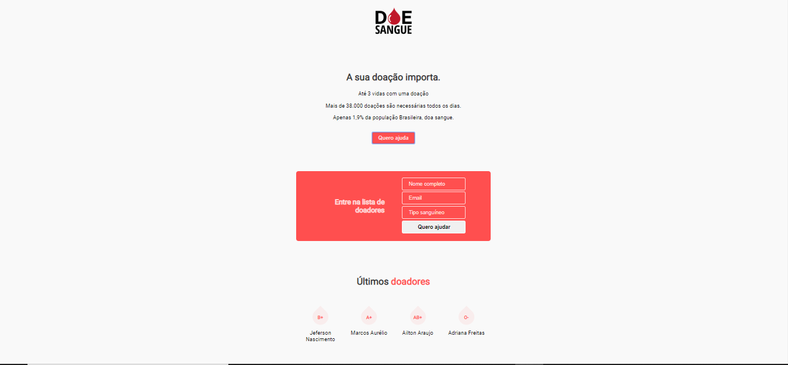

# Project Title

DOE

## Getting Started

App de cadastro de doadores de sangues utilzando HTLM5, CSS3, Javascript[NODEJS] e banco de dados Postgres

  

### Prerequisites

Noções básica de lógica, linha de comandos

## Como contribuir

- Faça um fork desse repositório;
- Cria uma branch com a sua feature: `git checkout -b minha-feature`;
- Faça commit das suas alterações: `git commit -m 'feat: Minha nova feature'`;
- Faça push para a sua branch: `git push origin minha-feature`.

Depois que o merge da sua pull request for feito, você pode deletar a sua branch.

## Built With

- [Node.js](https://nodejs.org/en/)
- [Postgres](https://www.postgresql.org/download/)
- [Nunjucks](https://mozilla.github.io/nunjucks/)
- [Express](https://expressjs.com/)

## Authors

* **Jeferson Nascimento** - *Initial work* - [calljef](https://github.com/calljef)

## License

Esse projeto está sob a licença MIT. Veja o arquivo [LICENSE](LICENSE.md) para mais detalhes.

## Acknowledgments

* Rocketseat(https://rocketseat.com.br/)
* Mayke Brito e a comunidade da Rocketseat
